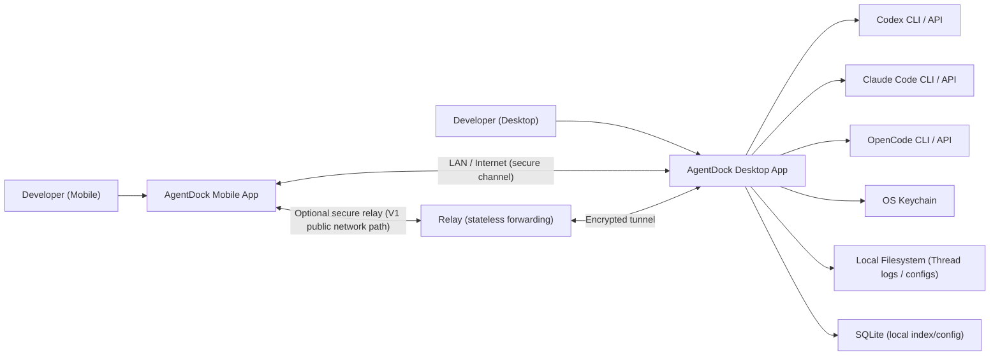
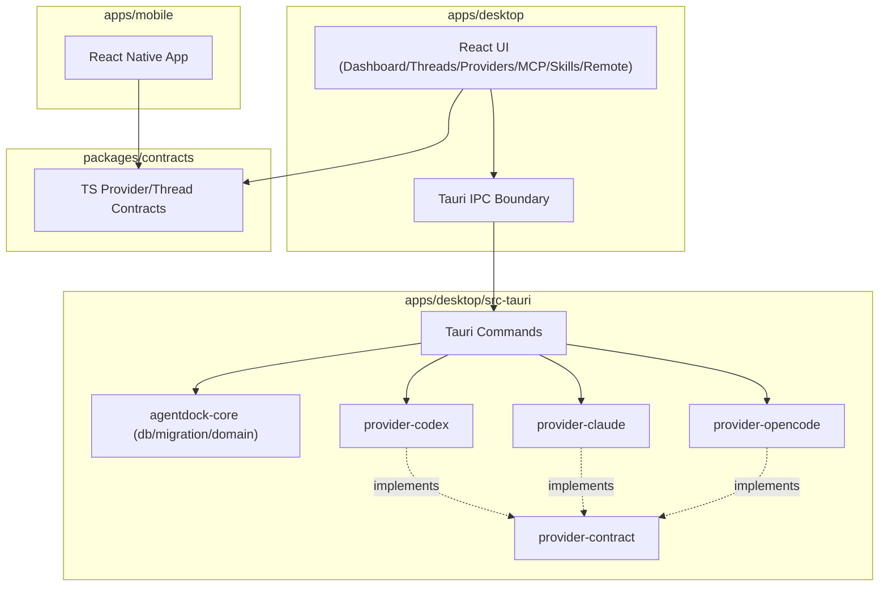
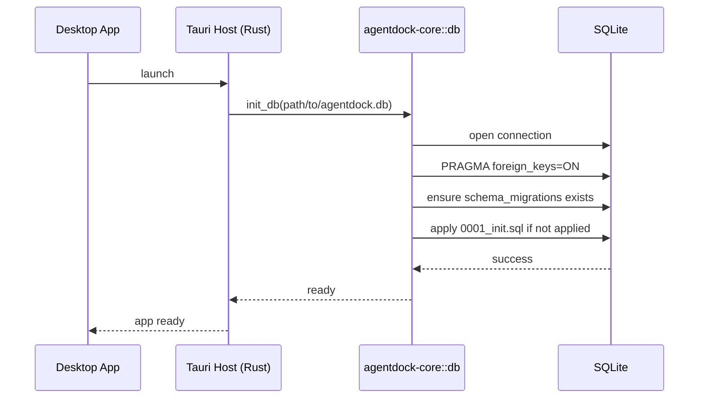
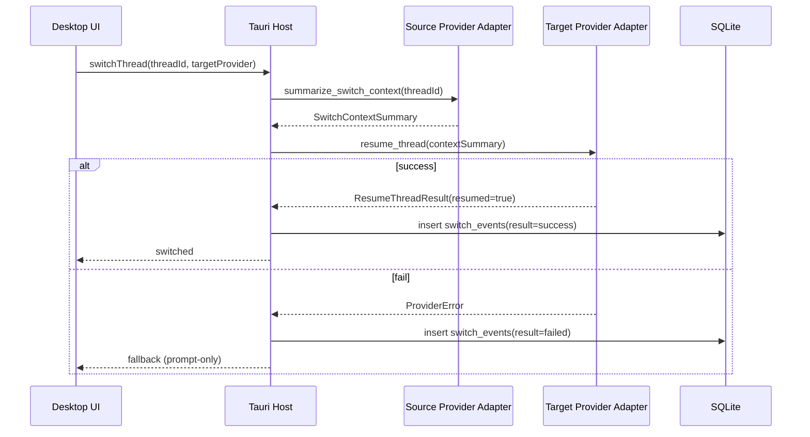
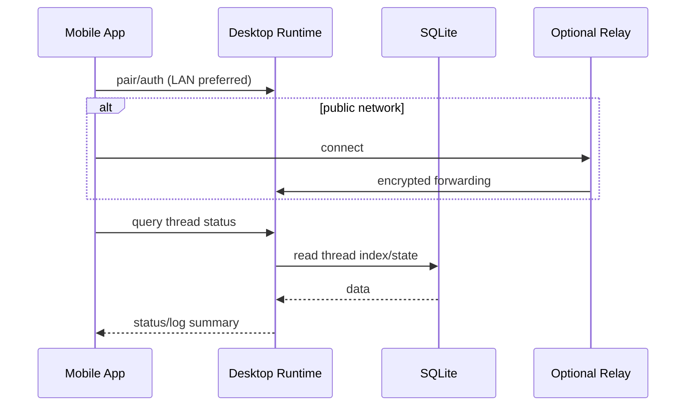
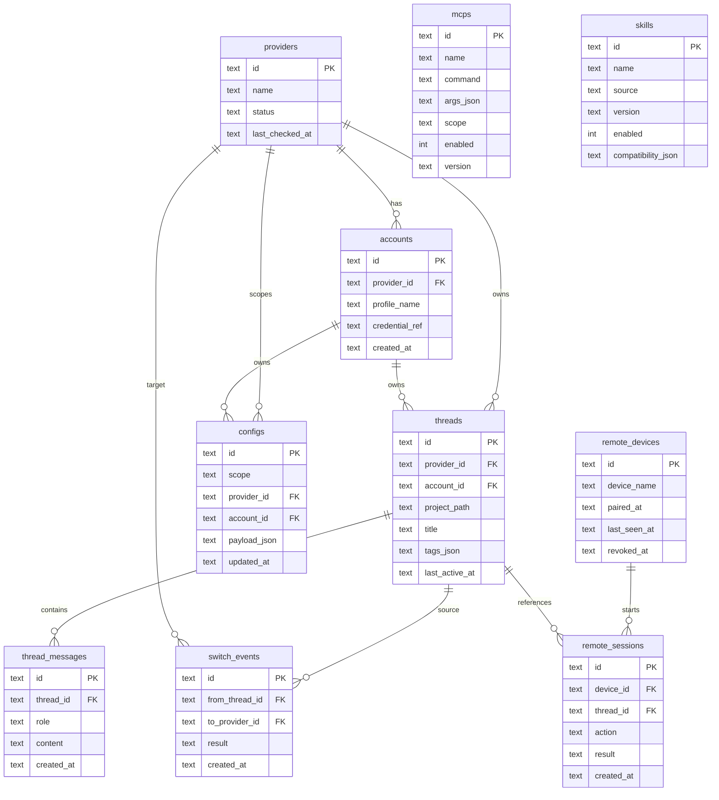
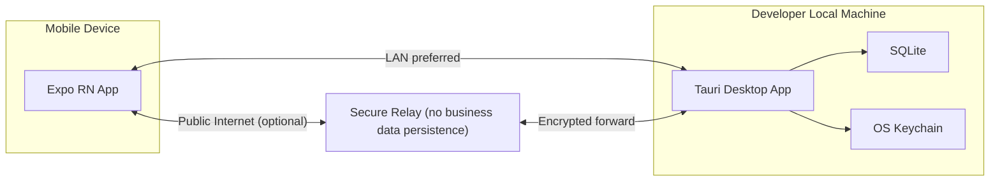

# AgentDock V1 Architecture Design

> Historical architecture document (V1 planning baseline).
> The errata section below is authoritative for current implementation as of 2026-02-24.

## Historical + Errata (2026-02-24)

| Topic | Historical Text | Current Implementation Truth |
| --- | --- | --- |
| Provider scope | Two providers (`codex`, `claude_code`) | Current code/contract scope: `codex`, `claude_code`, `opencode`. |
| Adapter maturity | Dual-provider contract + adapter stubs | Adapters are implemented in `provider-codex`, `provider-claude`, and `provider-opencode`. |
| Contract methods | Includes `summarizeSwitchContext` alignment | Current shared contract/trait includes `health_check`, `list_threads`, `resume_thread` only. |
| Switch flow | Uses `summarize_switch_context` runtime call | This is a historical target flow, not a current contract API. |
| Desktop interaction model | Broader thread-management assumptions | Current execution UI is terminal-only for thread continuation. |

## 1. Document Goal

This document describes an implementable architecture for AgentDock V1, covering the current repository baseline and near-term implementation boundaries, for engineering, testing, and follow-up extension work (V1.1).

V1 goals:

- Local-first, with no cloud sync dependency as the primary path
- Support three providers: `codex`, `claude_code`, `opencode`
- Unified management of accounts, configs, MCP, skills, and threads, plus mobile remote viewing/action entry

---

## 2. Current Technical Baseline

- Desktop: Tauri + React + TypeScript
  - UI: `apps/desktop/src`
  - Host: `apps/desktop/src-tauri`
- Mobile: Expo + React Native + TypeScript
  - `apps/mobile`
- Shared TS contracts:
  - `packages/contracts`
- Rust workspace:
  - `crates/provider-contract`
  - `crates/provider-codex`
  - `crates/provider-claude`
  - `crates/provider-opencode`
  - `crates/agentdock-core`
- Data storage: SQLite (migrations under `crates/agentdock-core/migrations`)
- Package manager: Bun workspace (`bun.lockb`)

---

## 3. Architectural Principles

- Local-first: core state is readable and recoverable locally
- Contract-first: TS and Rust share semantically aligned provider contracts
- Adapter isolation: provider-specific differences are converged into the adapter layer
- Incremental extensibility: keep remote/relay extension points in V1 without introducing early cloud-state complexity
- Secure by default: no plaintext credentials; remote control starts from least privilege

---

## 4. System Context Diagram

---

## 5. Container and Module Layering

---

## 6. Core Runtime Flows

### 6.1 Desktop Startup and Database Initialization

Current implementation executes on desktop host startup:

- Resolve app data directory
- Create `agentdock.db`
- Run `init_db` + `run_migrations`

### 6.2 Cross-Provider Thread Switch (Historical Target Flow, Not Current Contract API)

### 6.3 Mobile Remote View/Action (V1 Design Path)

---

## 7. Data Model (V1)

The following entities are based on migration `0001_init.sql`.

---

## 8. Deployment and Network Topology (V1)

---

## 9. Contract and Boundary Design

### 9.1 Provider Contracts (Dual-Side Sync)

- TS: `packages/contracts/src/provider.ts`
- Rust: `crates/provider-contract/src/lib.rs`

Sync constraints:

- Provider IDs: `codex`, `claude_code`, `opencode`
- Consistent error-code semantics (for example `not_implemented`)
- `healthCheck/listThreads/resumeThread` aligned with Rust traits

### 9.2 Adapter Boundaries

- `provider-codex`, `provider-claude`, and `provider-opencode` are implementation layers depending on `provider-contract`
- UI and business layer must not depend directly on provider-specific protocol details
- New providers should be added as new crates implementing the trait, instead of changing upper-layer workflows

---

## 10. Security and Reliability Design

- Credentials are stored as keychain references, not plaintext in SQLite
- Foreign key constraints enabled by default in DB (`PRAGMA foreign_keys=ON`)
- Migration execution is reentrant to avoid schema issues on repeated startup
- Remote control starts with least privilege; write actions require explicit allowlist policy
- Provider call timeout/error/fallback (prompt-only) should follow a unified strategy (gradually completed in V1)

---

## 11. Observability Recommendations (V1 -> V1.1)

- Local log levels: `INFO/WARN/ERROR`, with module tags (provider/db/remote/switch)
- Key metrics:
  - provider health-check success rate
  - thread resume success rate
  - switch latency (P50/P95)
  - remote action success rate
- Switch and remote actions should persist to event tables (already available: `switch_events`, `remote_sessions`)

---

## 12. Evolution Plan

### V1 (Current)

- Connect desktop startup flow with local DB initialization
- Solidify three-provider contracts and adapter implementations
- Establish unified data model and migration mechanism

### V1.1

- Explore additional providers beyond current three-provider baseline
- Improve switch-context strategy and failure fallback UX
- Strengthen remote-control secure pairing and permission model

### V2 (Direction)

- Team collaboration and optional cloud sync
- More complete audit, policy engine, and plugin ecosystem

---

## 13. Acceptance Checklist

- `bun run typecheck` passes
- `bun run test` passes
- Desktop app auto-creates and migrates local SQLite on startup
- TS and Rust provider contracts remain semantically aligned
- New migrations follow append-only policy (no edits to historical migrations)
