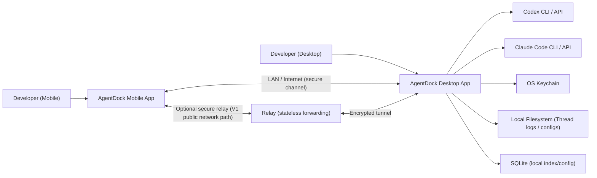
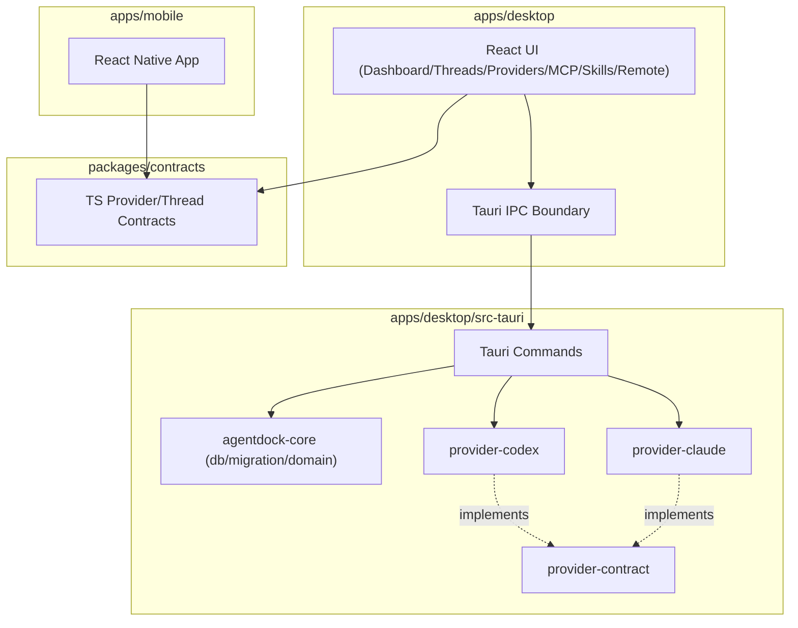
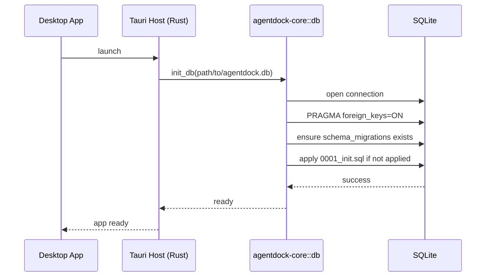
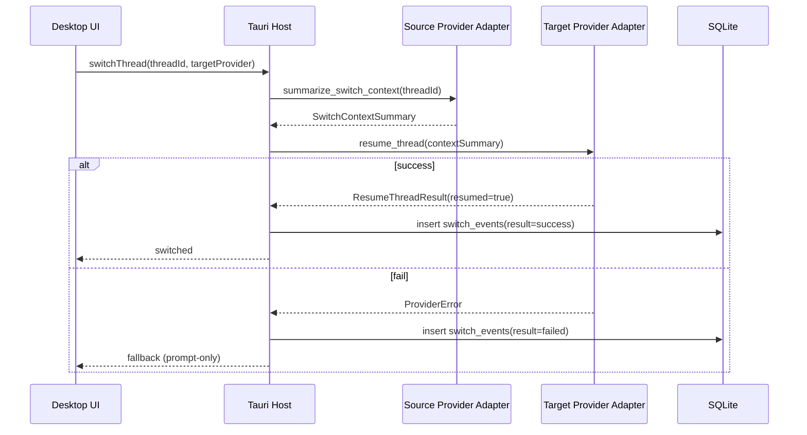
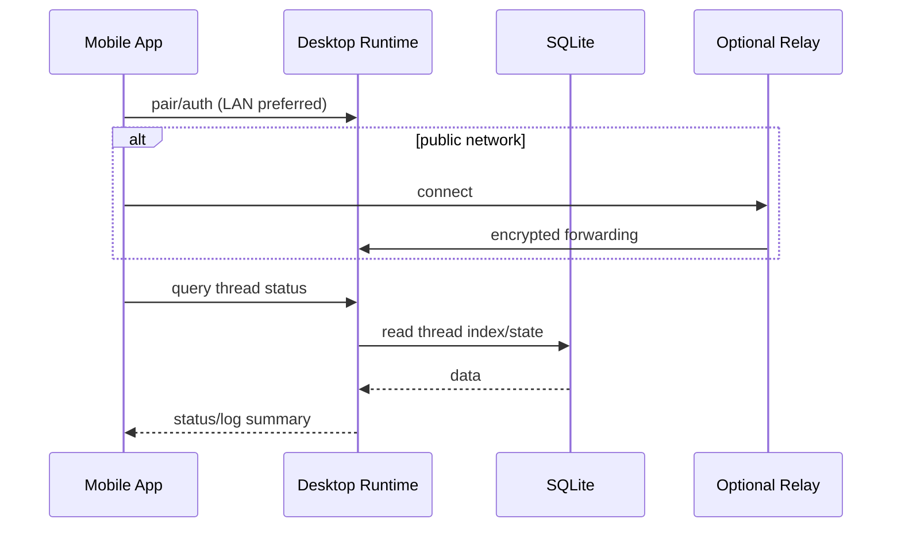
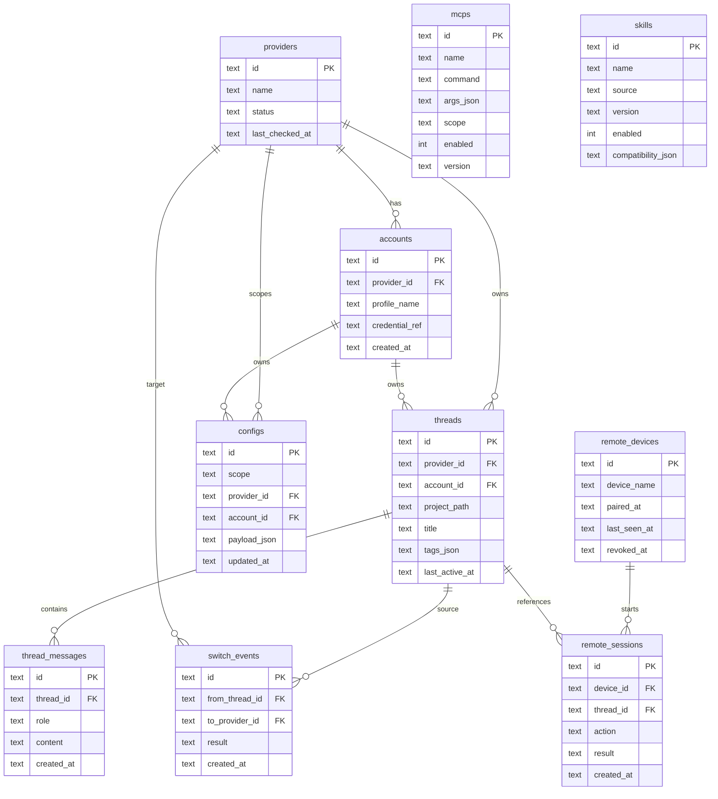
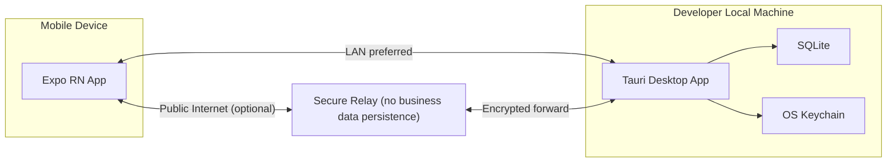

# AgentDock V1 架构设计文档

## 1. 文档目标

本文档描述 AgentDock V1 的可实现架构方案，覆盖当前仓库已有结构与近期实现边界，供研发、测试和后续扩展（V1.1）使用。

V1 目标：

- 本地优先（local-first），不依赖云同步作为主路径。
- 支持双 Provider：`codex`、`claude_code`。
- 统一管理账号、配置、MCP、Skills、Thread，并支持手机端远程查看/操作入口。

---

## 2. 当前技术基线

- 桌面端：Tauri + React + TypeScript
  - UI：`apps/desktop/src`
  - Host：`apps/desktop/src-tauri`
- 移动端：Expo + React Native + TypeScript
  - `apps/mobile`
- 共享 TS 契约：
  - `packages/contracts`
- Rust Workspace：
  - `crates/provider-contract`
  - `crates/provider-codex`
  - `crates/provider-claude`
  - `crates/agentdock-core`
- 数据存储：SQLite（迁移在 `crates/agentdock-core/migrations`）
- 包管理：Bun Workspace（`bun.lockb`）

---

## 3. 架构原则

- 本地优先：核心状态本地可读可恢复。
- 契约优先：TS 与 Rust 共享语义一致的 Provider 契约。
- 适配器隔离：Provider 差异收敛到 adapter 层。
- 渐进扩展：V1 保留远程/relay 接入点，不提前引入复杂云状态。
- 安全默认：凭据不落明文，远程控制最小权限起步。

---

## 4. 系统上下文图

---

## 5. 容器与模块分层

---

## 6. 核心运行流程

### 6.1 桌面启动与数据库初始化

当前实现在桌面 Host 启动时执行：

- 获取 app data 目录
- 创建 `agentdock.db`
- 运行 `init_db` + `run_migrations`

### 6.2 Thread 跨 Provider 切换（V1 目标流程）

### 6.3 手机远程查看/操作（V1 设计路径）

---

## 7. 数据模型（V1）

以下模型来自当前迁移文件 `0001_init.sql`。

---

## 8. 部署与网络拓扑（V1）

---

## 9. 契约与边界设计

### 9.1 Provider 契约（双端同步）

- TS：`packages/contracts/src/provider.ts`
- Rust：`crates/provider-contract/src/lib.rs`

同步约束：

- Provider ID：`codex`、`claude_code`
- 错误码语义一致（如 `not_implemented`）
- `healthCheck/listThreads/resumeThread/summarizeSwitchContext` 与 Rust trait 对齐

### 9.2 适配器边界

- `provider-codex`、`provider-claude` 作为实现层，依赖 `provider-contract`
- UI 与业务层不直接依赖 Provider 细节协议
- 新增 Provider（如 Gemini/OpenCode）应通过新增 crate 实现 trait，而非修改上层流程

---

## 10. 安全与可靠性设计

- 凭据仅保存 keychain 引用，不落 SQLite 明文。
- 数据库默认开启外键约束（`PRAGMA foreign_keys=ON`）。
- 迁移执行可重入，避免重复启动导致 schema 异常。
- 远程控制默认最小权限，写操作需要明确白名单策略。
- Provider 调用超时、错误码、失败回退（prompt-only）需要统一策略（V1 逐步实现）。

---

## 11. 可观测性建议（V1->V1.1）

- 本地日志分级：`INFO/WARN/ERROR`，按模块打标签（provider/db/remote/switch）。
- 关键指标：
  - Provider 健康检查成功率
  - Thread 恢复成功率
  - 切换耗时（P50/P95）
  - 远程操作成功率
- Switch 与 Remote 行为落事件表（当前已有 `switch_events`、`remote_sessions`）。

---

## 12. 演进计划

### V1（当前）

- 打通桌面与本地数据库初始化
- 固化双 Provider 契约与 adapter stub
- 建立统一数据模型与迁移机制

### V1.1

- 接入 `gemini`、`opencode` provider adapter
- 完善线程切换上下文摘要与失败回退策略
- 增强远程控制安全配对与权限模型

### V2（方向）

- 团队协作与可选云同步
- 更完整审计、策略引擎与插件生态

---

## 13. 验收清单

- `bun run typecheck` 通过
- `bun run test` 通过
- 桌面应用启动后自动创建并迁移本地 SQLite
- TS 与 Rust Provider 契约字段语义一致
- 迁移新增遵循 append-only，不改历史迁移
