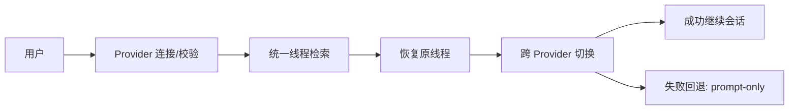
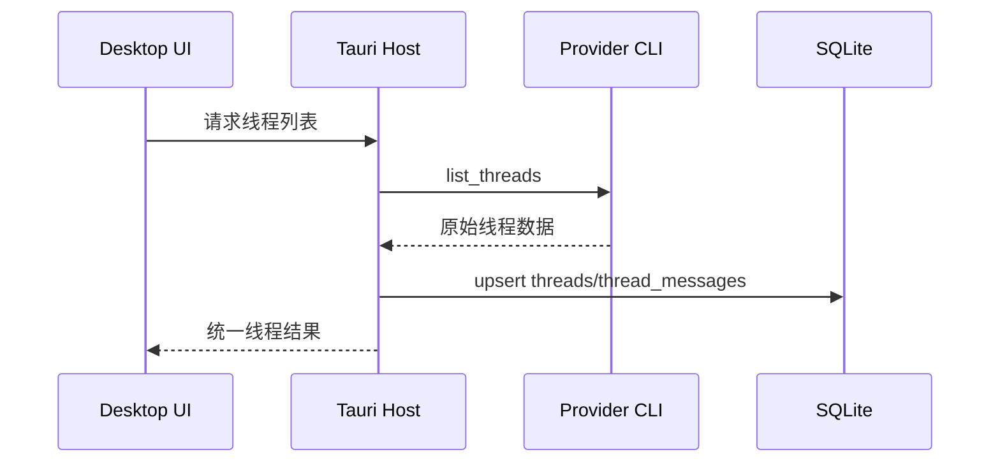

# Product Requirements Document: AgentDock 第一阶段（Phase 1）

**Version**: 1.0  
**Date**: 2026-02-11  
**Owner**: Product / Engineering

---

## 1. 执行摘要

第一阶段目标是把 AgentDock 从“架构骨架”推进到“可用于日常开发工作流”的最小可用产品（P0），重点打通双 Provider（`codex`、`claude_code`）的真实会话执行和统一会话检索。

核心原则已经确认：
- 最终执行 Agent 会话仍由各 Provider CLI 完成（`codex` / `claude code`）。
- 会话原始信息以 CLI 侧数据为事实来源（source of truth）。
- AgentDock 负责统一索引、检索、标签、切换编排和本地控制，不替代 CLI 会话引擎。

---

## 2. 问题定义

当前问题：
- 多 Agent 切换成本高：账号、配置、上下文和历史会话分散。
- 会话不可统一检索：不同 CLI 历史记录结构不一致，难以恢复上下文。
- 切换过程重复劳动：跨 Provider 时频繁手动复制上下文。

第一阶段解决方案：
- 打通 CLI 适配器层，完成会话执行与读取。
- 建立统一线程中心（Thread Center）和最小切换器（Switcher）。
- 构建本地优先的数据索引与事件记录基线。

---

## 3. 目标与成功指标（Phase 1）

### 3.1 业务目标
- 让重度 AI 编程用户在一个桌面控制台完成双 Provider 的连接、查询、恢复与切换。
- 将“找会话 + 继续会话 + 切换 Provider”流程收敛到统一入口。

### 3.2 成功指标（验收目标）
- 首次完成双 Provider 连接时间 <= 10 分钟。
- 已索引线程恢复成功率 >= 95%。
- 跨 Provider 切换操作中位耗时 <= 8 秒（不含目标 Provider 外部排队时间）。
- 第一阶段范围内关键流程端到端成功率 >= 98%（非网络异常场景）。

---

## 4. 范围定义

### 4.1 In Scope（第一阶段必须交付）
- Provider 连接与健康检查（`codex`、`claude_code`）。
- 账号/Profile 与凭据引用管理（不存明文密钥）。
- 配置中心（global/project/profile 三层覆盖，最小可用）。
- Thread Center：统一会话列表、筛选、搜索、恢复。
- 会话信息从 CLI 数据源读取并落本地索引。
- Switcher：从当前线程切换到目标 Provider（最小上下文摘要 + 失败回退）。
- 事件审计基线：`switch_events`、关键操作日志。

### 4.2 Out of Scope（第一阶段不做）
- 团队协作与云同步。
- 复杂计费系统。
- 完整移动端远程操作闭环（可保留只读接口预埋，不作为阶段验收门槛）。
- 新 Provider（`gemini`、`opencode`）接入。

---

## 5. 用户与核心场景

### 5.1 目标用户
- 重度 AI 编程用户（每天跨 2 个以上 Agent）。
- 技术内容创作者（需要频繁恢复旧线程）。

### 5.2 核心场景
- 场景 A：用户连接 Codex 和 Claude CLI，快速验证可用性。
- 场景 B：用户在 AgentDock 中统一查看两边历史线程并搜索定位。
- 场景 C：用户从 Codex 线程切到 Claude，自动附带最小上下文摘要。
- 场景 D：切换失败时系统提供 prompt-only 回退并记录事件。

---

## 6. 功能需求

## FR-01 Provider CLI 适配与执行
- 系统必须通过 Provider Adapter 调用真实 CLI 执行会话操作。
- 支持 `codex`、`claude_code` 两个 Provider ID。
- 适配器能力包含：
  - `health_check`
  - `list_threads`
  - `resume_thread`
  - `summarize_switch_context`
- 必须支持命令超时、错误码标准化和重试标记。

**验收标准**
- Provider 健康检查状态可区分 `healthy/degraded/offline`。
- 适配器错误统一映射为约定错误码（如 `not_implemented`、`timeout` 等）。

## FR-02 账号与凭据引用管理
- 支持一个 Provider 下多个 profile（如工作/个人）。
- 数据库存储 `credential_ref`，不存明文 key。
- 缺失/失效凭据状态可被检查并提示。

**验收标准**
- `accounts` 表可支持同 Provider 多 profile，且唯一性约束生效。
- 凭据缺失时 UI 提示可恢复，不导致程序崩溃。

## FR-03 配置中心（最小可用）
- 支持 `global`、`project`、`profile` 三层配置覆盖。
- 配置持久化至 `configs.payload_json`。
- 支持导入导出（JSON）。

**验收标准**
- 同一字段按优先级正确合并（profile > project > global）。
- 导入非法 JSON 时返回可读错误。

## FR-04 线程读取与统一索引
- 线程原始信息从 Provider CLI 数据读取。
- AgentDock 将线程元数据和消息索引写入本地 SQLite。
- 提供按 provider/project/tag/time 的筛选和关键字搜索。

**验收标准**
- 可同时展示两个 Provider 的线程列表。
- 至少支持标题/消息内容关键字搜索。
- 数据读取失败不会污染已存在索引。

## FR-05 线程恢复（Resume）
- 用户从 Thread Center 选择线程后可恢复到对应 Provider。
- 恢复操作需返回结构化结果（是否恢复成功、提示信息）。

**验收标准**
- 成功时返回 `resumed=true` 且可继续会话。
- 失败时返回标准化错误，且前端有可见反馈。

## FR-06 Switcher（跨 Provider）
- 从源线程生成最小上下文摘要：目标、约束、未完成任务。
- 将摘要注入目标 Provider 的恢复请求。
- 失败时提供 prompt-only 回退路径。
- 切换行为写入 `switch_events`。

**验收标准**
- 成功切换时记录 `switch_events.result=success`。
- 失败切换时记录 `switch_events.result=failed` 且回退可执行。

## FR-07 数据与迁移基线
- 数据模型以 `0001_init.sql` 为基线，遵循 append-only migration。
- 每次启动自动执行 `init_db` 和 `run_migrations`，具备幂等性。

**验收标准**
- 空数据库首次启动可自动建表。
- 重复启动不重复执行已应用迁移。

---

## 7. 非功能需求

### 7.1 性能
- 线程列表读取（本地索引）P95 < 500ms。
- 单次切换编排（不含外部 CLI 等待）P95 < 2s。

### 7.2 可靠性
- 关键流程（连接、索引、恢复、切换）必须有错误分类和可观测日志。
- 数据迁移与索引更新必须具备失败回滚/事务边界。

### 7.3 安全
- API key 不落明文。
- 仅记录必要日志，敏感字段脱敏。
- 默认最小权限执行外部命令。

---

## 8. 数据与接口约束

### 8.1 数据模型（第一阶段必须可用）
- `providers`
- `accounts`
- `configs`
- `threads`
- `thread_messages`
- `switch_events`
- 其他表可保留但不要求第一阶段全部业务化。

### 8.2 契约同步
- TypeScript：`packages/contracts/src/provider.ts`
- Rust：`crates/provider-contract/src/lib.rs`

任何字段或语义变更必须双边同步并补充测试。

---

## 9. 里程碑与交付计划（建议 4 周）

### Week 1
- 打通双 Provider health check + account/profile 存储。
- CLI 线程读取原型（list_threads）。

### Week 2
- 完成线程索引入库与 Thread Center 列表/搜索基础能力。
- 完成 resume_thread 端到端流程。

### Week 3
- 完成 Switcher 编排与最小上下文摘要。
- 落地切换失败回退与事件记录。

### Week 4
- 性能调优、稳定性修复、验收测试与发布准备。

---

## 10. 测试与验收清单

- `bun run typecheck` 全通过。
- `bun run test` 全通过。
- `cargo test --workspace` 全通过。
- 双 Provider 可完成 connect -> list -> resume 最小链路。
- CLI 会话数据可被索引并检索。
- 切换成功/失败都能产生 `switch_events` 记录。

---

## 11. 风险与应对

| 风险 | 概率 | 影响 | 缓解策略 |
|------|------|------|----------|
| CLI 输出格式变化导致解析失败 | 中 | 高 | 适配器契约测试 + 版本兼容层 |
| 不同平台命令行为不一致 | 中 | 中 | 按 OS 增加命令执行抽象与回归用例 |
| 大量历史会话导入性能波动 | 中 | 中 | 分批索引 + 增量更新 + 索引优化 |
| 凭据状态异常影响体验 | 低 | 高 | 启动即校验 + 明确错误提示与修复入口 |

---

## 12. 第一阶段完成定义（Definition of Done）

当且仅当以下条件全部满足，第一阶段视为完成：
- 双 Provider CLI 会话链路可在桌面端稳定运行。
- 线程统一检索与恢复达到可日常使用水平。
- 跨 Provider 切换具备可用回退策略。
- 数据、契约、迁移、日志与测试满足本文件约束。
